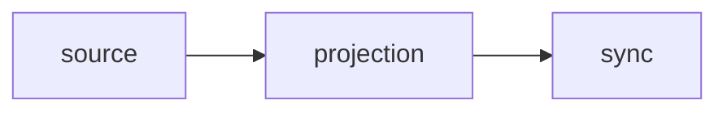

# Architecture

Three capability modules carry the work: `source`, `projection` and `sync`. `cli` sits on top and drives them. `config` parses `phora.toml` at the edge; `sync` converts it into value types before projection sees it. `lock`, `paths`, `digest`, `diagnostic` and `error` are shared support modules.

Configuration keys, flags and exit codes are in [REFERENCE.md](../REFERENCE.md). The user-facing model is in [GUIDE.md](../GUIDE.md).

## The source → projection → sync decision

The architectural decision is the capability chain source → projection → sync. It decides where every responsibility lives.



- *source* obtains immutable content. Given a git remote, a URL or a local working tree, it resolves a snapshot and exposes an inventory of entries and their bytes. It performs source and cache I/O.
- *projection* computes the desired target structure from source values and inventories: a `Projection` of artifacts and their leaves. It performs no I/O.
- *sync* owns target-side machine state. It observes the disk, reconciles it against the projection, stages and applies changes, journals them for recovery, and owns registry records, ejections, hook state and locking.

Link-mode artifacts are the exception to snapshot immutability: link artifacts materialize as symlinks into the live worktree, while `SnapshotId::Worktree` freezes inventory and copy-mode reads.

Data flows one way, from source to projection to sync. Imports follow the same direction: sync imports projection and source, projection imports source's pure value types, and an upstream module imports nothing downstream.

## Module placement rule

A change belongs to the module whose responsibility it matches:

- source obtains immutable content: it reads and fetches origin bytes into a snapshot and never mutates them.
- projection is a pure, I/O-free calculation: it computes a deterministic `Projection` of the desired structure from values and inventories alone.
- sync is the sole owner of target machine state: observation, reconciliation, staging, application, recovery, state records and locking.

Work that needs the filesystem or the network to decide the target shape does not go in projection. Work that inspects or changes the machine goes in sync. Work that acquires origin content goes in source. Projection owns `TargetName` and `ArtifactName`; source owns `SourceName` and `Commit`.

## Invariants

`scripts/arch-check.sh` lints the imports and I/O calls in `src/`. It runs through `tests/arch_check.rs` and in CI. Module privacy covers the rest.

### INV-1: projection purity

Projection performs no I/O; it is a pure calculation of the desired target structure.

The lint gives `src/projection/` a positive allowlist. A projection file may import:

- its own modules (`self`, `super`, `crate::projection`);
- `crate::error` and `crate::diagnostic`;
- from `crate::source`, only `SourcePath`, `SourceInventory`, `SourceEntryMeta`, `SourceEntryKind`, `SourceName`, `Commit`, `safe_component` and `safe_relpath`;
- `std`, except `std::fs`, `std::io`, `std::net`, `std::os` and `std::process`;
- the external crates `globset` and `unicode_normalization`.

Any other import fails the lint, including `config`, `sync`, `cli`, `gix` and `serde`. The lint also checks fully qualified `crate::` paths and `std::fs::`-style calls outside `use` lines.

### INV-2: source boundary

Source never imports projection, sync or target types. A file under `src/source/` may not import `crate::projection`, `crate::sync`, `crate::config::target`, or `TemplateOptIn`, and the lint applies the same rule to fully qualified paths. `digest_snapshot` takes an explicit list of leaves, so computing a digest needs no projection type.

### INV-3 to INV-9

- INV-3: target-side writes happen in `sync` and `cli`, with one exception. `source::worktree_deploy` writes the history overlay's `.git` gitlink, and the placeholder directories for submodule entries, under the deploy root. It runs only when sync calls it, under the per-mirror lock. Outside that, source performs source and cache I/O, and projection performs none. The lint allows filesystem, process and network APIs only in `sync`, `cli`, `main.rs` and the source I/O owners listed in `SOURCE_IO_OWNERS`.
- INV-4: serialized formats stay compatible. `phora.lock`, registry records, target metadata and the journal keep schema version 1. A field added later is optional: it reads as its default when absent and is left out on write when unset or empty. Older files still parse, and a file that doesn't use a feature serializes as it did before the feature existed. `tests/compat_serialized.rs` pins the formats against goldens in `tests/compat/serialized/`.
- INV-5: staging is deterministic. The same snapshot, selection, vars and export policy produce the same bytes, modes, mtimes, manifest and digests.
- INV-6: URL sources resolve to the same snapshot representation as git sources, `SnapshotId::Git` over a synthetic commit. Working-tree snapshots import the captured tree the same way, so inventory and reads see one frozen tree.
- INV-7: `preview`, `sync` and prune compute artifact identities from the same projection code (`sync/plan.rs`).
- INV-8: `sync::reconcile` is a pure function of `(Projection, ObservedProjectState, policy)`. The lint forbids filesystem APIs and `Path` filesystem methods in `sync/reconcile.rs`.
- INV-9: human-readable CLI output and exit codes are a compatibility surface. `cli/render.rs` produces the output, `cli::exit_code` maps errors to codes, and only `main.rs` calls `std::process::exit`.

## Storage

phora keeps two trees. The *cache root* holds regenerable git mirrors. The *state root* holds per-project records that can't be regenerated.

| Root | Default | Override |
| --- | --- | --- |
| cache | `$XDG_CACHE_HOME/phora`, else `~/.cache/phora` (Linux) or `~/Library/Caches/phora` (macOS) | `[paths] cache` |
| state | `$XDG_STATE_HOME/phora`, else `~/.local/state/phora` (Linux) or `~/Library/Application Support/phora` (macOS) | `[paths] state` |

An `XDG_*` value counts only when it is absolute. A `[paths]` value is the root itself, with no `phora` appended; a relative value is joined to the project directory. The resolution lives in `src/paths.rs`.

The cache root contains `git/`:

```
<cache>/git/
  <MirrorKey>.git/                  bare mirror
  <MirrorKey>.git.lock              per-mirror flock
  .<MirrorKey>.staging-<pid>-<n>/   clone or import in progress
  .phora-download-<pid>-<n>.tmp     URL download in progress
```

The state root contains one directory per project:

```
<state>/projects/<ProjectId>/
  locks/state.lock                                  per-project lock
  locks/journal.toml                                deploy journal
  targets/<target>/meta.toml                        ejections, hook state
  targets/<target>/artifacts/<identity>/<artifact>.toml   registry record
```

The record path uses the binding *identity*, so two bindings of one source in the same target keep separate records.

### Mirror keys

One mirror serves every source that names the same remote. `NormalizedUrl::parse` maps equivalent spellings to one string:

1. Trim whitespace and a trailing `/`.
2. Rewrite scp-style `git@host:owner/repo` to `host/owner/repo`.
3. Otherwise drop the scheme and any `user@` prefix.
4. Strip a trailing `.git`.
5. Lowercase the host.

`MirrorKey` is the first 16 hex characters of the BLAKE3 hash of that string. HTTPS and SSH spellings of one repository share a mirror.

### Project identity

`ProjectId` is the first 16 hex characters of the BLAKE3 hash of the canonicalized project root. A symlinked checkout and its target resolve to the same id and share records. Two clones at different paths get different ids.

## Sources

A mirror is a bare repository. Resolving a ref looks up a commit id, and reading a file walks tree objects and reads the blob from the object database. Nothing is checked out for copy-mode deployment. Two bindings at different refs of one source are two commit ids in one mirror, sharing every unchanged object.

Two exceptions add files outside the object database. A history binding creates linked-worktree administration inside the mirror and a gitlink in the target (see [History overlay](#history-overlay)). A mirror that serves history bindings also carries `refs/phora/worktrees/*` pins.

`RouterBackend` routes each `ResolveRequest` by its `SourceLocation`: `Url` to `HttpBackend`, which imports the download into a git mirror, and `Git` and `Worktree` to `GitBackend`, which also captures working trees. Every other call goes to `GitBackend`. `GitBackend`, `HttpBackend` and `RouterBackend` implement `SourceStore`, which has seven methods: `resolve`, `inventory`, `read` and `list_directory`, plus `lock_worktree_mirror`, `lock_worktree_mirror_at` and `observe_worktree`, which have default implementations that return an error. `GitBackend` implements all seven.

### Fetching a git source

`GitBackend::refresh_mirror` (`source/git.rs`, `source/cache.rs`) runs under the mirror's flock:

1. Remove `.<MirrorKey>.staging-*` directories whose newest mtime is more than an hour old. A younger one may belong to a running clone.
2. If the mirror opens, detach the `HEAD` of every managed linked worktree (`worktrees/ph-*`), then fetch with the refspecs `+refs/heads/*:refs/heads/*` and `+refs/tags/*:refs/tags/*`. Heads and tags track the remote, so a tag-pinned commit resolves after one fetch.
3. If the fetch reports a rejected ref update, return the error. The mirror stays as it is.
4. If the mirror is missing, is not a repository, or the fetch fails for any other reason, re-clone.

A re-clone builds a new bare mirror in a staging directory. Before the swap it carries over every managed worktree whose pin commit exists in the new clone: the `worktrees/ph-<id>/` administration directory and its `refs/phora/worktrees/<id>` pin. Then it removes the old mirror and renames the staging directory into place. A failed clone leaves the old mirror untouched. An open failure other than "not a repository" is an error and doesn't trigger a re-clone, because it may be transient.

Resolution is a local lookup. A `branch` peels `refs/heads/<name>`, a `tag` peels `refs/tags/<name>`, a `rev` is parsed as a 40- or 64-hex object id, and a source with no ref takes the mirror's `HEAD`.

### Importing a URL source

`HttpBackend::refresh_import` (`source/import.rs`, `source/http.rs`, `source/archive.rs`) runs four steps:

1. Download into `<cache>/git/.phora-download-<pid>-<n>.tmp`. phora follows redirects itself, up to 10. A redirect may go to `https`, or to `http` only when the original URL was `http`. Connecting times out after 30 seconds and reading the body after 5 minutes. A non-2xx status is an error. The temporary file is removed on every exit path.
2. Verify. When the source declares a `digest`, hash the downloaded bytes with its algorithm (`sha256` or `blake3`) and compare. A mismatch stops here.
3. Extract in memory. The format is detected from the bytes: gzip-compressed tar, tar, zip, or a single raw file named after the URL. Each entry path must be relative, contain no `..`, backslash or NUL, and not start with a drive letter. Extraction stops once the decompressed total passes 1 GiB. A single common top-level directory is stripped.
4. Take the mirror's flock and import the entries as git objects. Colliding entries, or a file where a directory is expected, are rejected. `refs/heads/phora` points at the new commit.

The flock is taken only for step 4, so two runs downloading the same archive overlap on the slow part.

The import is deterministic. The commit has a fixed author and committer (`phora <phora@localhost>`), the time 1 second after the epoch, the message `phora synthetic import`, and no parents. Tree entries are sorted in git order before writing. The commit id therefore depends only on file paths, modes and contents. Re-importing unchanged bytes produces the same id and leaves the lock unchanged.

A URL source resolves to `refs/heads/phora`, or to a pinned commit. Asking it for a branch, tag or default ref is an error.

### Capturing a working tree

A `deploy = "link"` source resolves through `capture_worktree` (`source/worktree.rs`). It walks the canonical working-tree root, skipping a cache directory inside it, and imports the files into a mirror keyed by the root path, using the same import as URL sources. The resulting commit id is the snapshot's `capture_digest`. Projection and copy-mode reads use that frozen tree. Link artifacts point at the live files.

## The sync pipeline

`sync::sync_core` (`sync/mod.rs`) runs these steps. Each step's progress phase, where it has one, is in parentheses.

1. Merge `phora.toml` with `phora.local.toml` and validate.
2. Run the `pre_sync` hooks. If one fails, the run ends here.
3. Compose transitive dependencies into the config (compose).
4. If any target has `phase = "prepare"` or `post_prepare` is set, split the run (see [Preparation](#preparation)). Otherwise run the workspace pipeline once over every target.

The workspace pipeline (`sync_workspace`):

1. Open the journal and run the recovery sweep.
2. Resolve every source (resolve).
3. Project every target (project), check the sealed offer, and plan `--fast-forward` drops.
4. With `--prune`, sweep stale history-overlay administration.
5. Observe the disk and reconcile it against the projection (observe). Resolve conflicts by prompt or policy.
6. Run each target's `pre_deploy` hooks. A failure under `pre_deploy_on_fail = "abort"` ends the run; under `"skip"` it skips that target.
7. If any `pre_deploy` hook ran, observe and reconcile again (observe). Earlier conflict answers are reused.
8. Apply fast-forward drops, then deploy each target's changes (apply).
9. If nothing failed, apply the reconciled removals (prune). With `--prune`, these include records the projection no longer produces.
10. Run hooks (hooks): each target's `on_change`, then the global `post_sync`, then trusted transitive `on_change` hooks.

Under `--frozen` on a read-only state root the run holds no lock. If observation finds anything to write, including a stat refresh, the run stops with an error naming the state root.

### Preparation

`sync/prepare.rs` splits one run into two passes that share the registry and journal:

1. Partition targets by `phase`. Each pass resolves the sources its own targets bind. A deploy target whose path lies inside a prepare target is rejected. A deploy target above a prepare target is projected first, and rejected if any artifact lands inside the prepare tree.
2. Run the workspace pipeline over the prepare targets, with the global `[hooks]` removed.
3. If that pass skipped or ejected anything, or failed, the run fails. Lock entries resolved so far are merged into the previous lock.
4. Run `post_prepare` hooks in order, stopping at the first failure. A failure fails the run.
5. Rebuild the prepare roots from the current config, so symlinks a generator created are seen, and run the workspace pipeline over the deploy targets. Sources resolve against the lock that the prepare pass produced.

## Resolution and the lock

### Execution model

`sync/resolve.rs` turns the config into resolution units. A unit is one pair of source and effective ref. Units group by `MirrorKey`. Groups resolve in parallel on a rayon pool; units inside a group resolve one after another, so a shared remote is fetched once. A git unit fetches only if no earlier unit in its group already did. A URL unit always downloads when it has no lock hit, because each source verifies its own digest.

The pool size is `--jobs` when given, else `min(units, max(50, 2 × cores))`. The ceiling is at least 50 because fetching waits on the network. `--jobs 0` is rejected.

Composition, staging and applying run on the main thread. Only resolution is parallel.

### Lock entries

`phora.lock` (`src/lock.rs`) holds one entry per unit. An entry records:

- `name`, `git` (the remote or URL), `resolved` (the effective ref, or `url`, or `link`), `commit`;
- `digest`: the BLAKE3 framed digest of the source's offered bytes at that commit;
- `config_digest`: BLAKE3 over the source's `include`, `exclude` and `root` and its `allow_symlinks` and `preserve_executable` settings;
- `ref`: the kind-tagged ref (`branch:x`, `tag:x`, `rev:x`), present only when a binding overrides the source's ref;
- `instance`: the owning transitive instance, absent for the consumer's own sources.

A binding's `take` never enters the lock. Narrowing a take changes the registry records and moves no commit. A source listed in `phora.local.toml` locks into `phora.local.lock`; transitive entries always go to the base lock. When merging the two, entries match on name, `ref` and `instance`.

A link-mode source locks as `resolved = "link"` and `digest = "link:"`, with the working tree's `HEAD` as commit, or `link` when it has none.

The lock also holds `[[trusted_hooks]]` and `[[candidate_hooks]]` for transitive hooks. Both are omitted when empty.

### Reusing a lock entry

A unit reuses its entry when:

- git source: the normalized resolved remote, the effective ref, and `config_digest` all match;
- URL source: the normalized URL and `config_digest` match. The synthetic commit is content-addressed, so the URL and config fully identify it.

On a match, phora resolves the locked commit from the cache. If the commit is missing, it fetches, unless `--frozen` is set, in which case it errors. The source digest is reused when the commit is unchanged. Without a match, the unit resolves its ref from the network, and `--frozen` fails naming the source. `update` drops the entries it advances before running the same path.

## Staging and applying

### Staging

`sync::stage::stage_artifact` writes one artifact into a staging directory:

```
<parent of the artifact's destination>/.phora-stage/<artifact>-<n>/
```

The staging directory sits beside the artifact's destination so the final rename stays on one filesystem. For each leaf, staging:

1. skips a destination with a `.git` path component, unless an `include` pattern has a `.git` segment or the binding is a history overlay;
2. renders `*.tmpl` files with the effective vars;
3. writes the bytes, sets the executable bit when the source had it and `preserve_executable` is on, and sets the mtime to the commit's author time;
4. rejects a symlink unless `allow_symlinks` is on (the default for history bindings), and rejects one whose target leaves the artifact;
5. rejects two leaves whose deployed names fold to the same path;
6. adds the entry to the manifest (size, mtime, BLAKE3) and to the artifact digest.

The artifact digest and the lock's source digest use one framing, `hash_framed_entry` in `src/source/mod.rs`. Each entry contributes its path length as a little-endian u64, the path, a type tag (`\0file\0`, `\0exec\0` or `\0link\0`), the payload length and the payload. Without the lengths, two different trees could hash alike.

### Applying

`sync::apply::apply_artifact_report` moves a staged artifact into place:

1. Append a journal entry (staging path, destination, record, `swap_completed = false`).
2. Rename an existing destination to `.phora-stage/.phora-backup-<name>`.
3. Rename the staging directory onto the destination. If the rename fails with a cross-device error, copy instead (reflink when available) and warn.
4. Mark the entry `swap_completed = true`.
5. For a history binding, publish the overlay.
6. Write the registry record.
7. Remove the journal entry.

If step 5 or 6 fails, the destination is removed, the backup is restored, and the journal entry is dropped. Link-mode artifacts follow the same journal protocol with a symlink created in `.phora-stage/` instead of a staged tree.

phora installs no signal handler. Ctrl-C kills the process, and the journal and staging directories leave enough to recover on the next run.

### Recovery

The recovery sweep runs at the start of each workspace pass:

1. For each journal entry: if the swap completed, write its record. Otherwise restore the backup if one exists and remove the staging path. Then drop the entry.
2. Remove `.phora-stage*` entries in the parent of every configured target path, or in the confine anchor of a composed target.

Step 1 covers every journaled deploy. Step 2 scans only target parents, so a staging directory abandoned inside a target directory before its journal entry was written stays until that directory is next deployed.

Under `--frozen` on a read-only state root, a pending journal entry is an error; nothing is discarded.

## Registry and drift

### Records

A registry record (`sync/state/file.rs`) stores the target, identity and artifact name, the underlying source, the commit, the staged artifact digest, the layout, the export policy, and a manifest of every file with size, mtime and BLAKE3 hash. Optional fields cover:

- `directories`: device, inode and mtime of each staged directory, for spotting added files without a full walk;
- `linked`, for link-mode artifacts;
- `history`, `worktree_admin_id`, `mirror_key`, `cache_git_root`, for history overlays;
- `vars_digest`, for templated artifacts;
- `deploy_root` and `layout_separator`, the target path and prefixed-layout separator as they were at deploy time.

phora never recomputes `deploy_root` or `layout_separator`, so a record whose target left the config still names where its files are.

Records are written to a temporary file and renamed into place.

### Drift detection

`sync::inspect` classifies each recorded artifact. For every manifest file:

1. Stat without following links. A missing file, or a file that is no longer a regular file, is modified.
2. If size and mtime match the manifest, the file is clean without reading it.
3. Otherwise open the file and check that the descriptor has the inode the stat saw. Read it, stat the descriptor again, and hash the bytes.
4. If the stat stayed stable and the hash matches, the file is revalidated with its new size and mtime. Any read error, inode mismatch or hash mismatch makes it modified.

A symlink entry matches when the link target's length and hash match. New files inside the artifact are found through the `directories` snapshot; history artifacts use a full scan that ignores `.git`.

The artifact is modified if any file is. Otherwise it is outdated if the commit or the vars digest changed, revalidated if some file only changed stat, and clean if nothing changed. `sync` writes revalidated stats back to the record so the next run takes step 2. A partly modified artifact keeps its old stats.

`phora verify` hashes every manifest file regardless of stat, skips linked and ejected records, and also fails on untrusted transitive hook candidates. History overlay findings are reported without failing.

### Two digests for templating

Templated artifacts carry two digests that answer different questions:

- The lock's `digest` covers source bytes before rendering. Two machines with different vars write the same lock.
- The record's manifest and artifact digest cover rendered bytes. `verify` and drift detection compare against what was deployed.

The record's `vars_digest` is BLAKE3 over the effective vars (base overlaid with local), framed per key. When it differs from the current vars, the artifact is outdated and redeploys, even though no commit moved. A rendering error fails only that artifact.

## Locking

- Per project: `sync`, `update`, `eject`, `uneject`, `rebuild-registry` and `trust` take a non-blocking exclusive lock on `locks/state.lock` for the whole command. If another process holds it, the command exits 75 (`EX_TEMPFAIL`). If the state root is on a network filesystem (NFS, SMB, CIFS, AFP, WebDAV), `sync` prints a one-line warning that the lock may not exclude other machines.
- Per mirror: fetch, URL import, working-tree capture and history-overlay changes take a blocking flock on `<MirrorKey>.git.lock`. The cache root is shared across projects, so this lock serializes two projects fetching one remote.

## Hooks

The consumer's `phora.toml` and `phora.local.toml` are the only places hooks come from. A `phora.toml` inside a synced source is content and is never parsed as configuration. The one exception is a `transitive = true` dependency, whose per-target hooks become candidates that need approval.

Hook scopes and their order in a run:

1. `pre_sync`, before any source is resolved.
2. The prepare pass, when prepare-phase targets exist: their `pre_deploy` gates, their deploys, their `on_change` hooks, then trusted transitive `on_change` hooks under prepare-target paths. Global `[hooks]` don't run inside this pass.
3. `post_prepare`, after the prepare pass succeeds.
4. The deploy pass: `pre_deploy` gates of deploy-phase targets, their deploys, `on_change`, `post_sync`, then trusted transitive `on_change` hooks.

Commands within a scope are deduplicated by command and shell.

`on_change` fires by comparing digests:

1. Each hook has an id: target name, command, and the shell or `exec` for the `cmd` form.
2. On success, phora stores the set of artifact digests in the target at that moment (`meta.toml`).
3. On the next run, the hook fires if any current record has a digest outside the stored set.

Removing an artifact leaves every remaining digest in the set, so removals alone don't fire the hook. A failed hook records nothing and fires again next run. `post_sync` runs on every run that reaches the hook phase. The only accepted `when` value is `"always"`.

A gate failure (`pre_sync`, or `pre_deploy` with `abort`) ends the run before any drop, deploy or prune in its pass, and later hooks don't run. A deploy-phase `pre_deploy` abort comes after the prepare pass, so prepare-phase targets stay deployed. What the hook itself did is not undone.

A transitive hook candidate is pinned by a preimage: BLAKE3 over the command, shell, hook kind and the dependency's resolved commit. It runs only when a `[[trusted_hooks]]` entry pins that preimage, or when the user approves it at the prompt. A new dependency commit changes the preimage and needs approval again.

## Transitive composition

`sync/transitive.rs` walks `transitive = true` imports serially before resolution:

1. Resolve the dependency and read its `phora.toml` at that commit. Only `[sources]`, `[targets]` and per-target hooks are kept; trust fields and the global `[hooks]` are dropped.
2. Key the download as a *fetch node*: normalized URL, ref and commit. Two paths to the same node fetch once.
3. Key its use as an *instance*: parent, source name, anchor target and fetch node. The same node mounted twice is two instances with separate names, hooks and confinement.
4. Compose each dependency target as a synthetic target at `<anchor path>/<dependency target path>`. Two composed targets with one destination are an error.
5. Recurse into the dependency's own imports, up to depth 64.

At depth 1 a source may use a local `path`, including the package's self source `path = "."`. Deeper, local paths, relative paths and `file://` remotes are rejected. Inner sources can't use `deploy = "link"`; the imported source itself can.

Every composed write is confined to its anchor. It is also kept out of a protected set: the project's `phora.toml`, `phora.local.toml`, `phora.lock`, `phora.local.lock` and `.git`, the state root's `projects/` directory, and the cache root.

## History overlay

A binding with `history = true` deploys the source's whole tree and makes the destination a linked git worktree of the mirror. The files come from normal staging; `source/worktree_deploy.rs` adds the git metadata after the swap.

The overlay's admin id is the first 16 hex characters of a framed BLAKE3 over the canonical project root, the deploy root, the target name and the binding identity. Publishing runs under the mirror's flock:

1. Build the administration in `<mirror>/.ph-<id>.staging-<pid>-<n>/`: `HEAD` with the detached commit, `commondir` (`../..`), `gitdir` pointing at `<deploy root>/.git`, and an index built from the commit's tree with the stat data of the deployed files.
2. Create empty directories in the deploy root for submodule entries.
3. Write `<deploy root>/.git.phora-staging-<n>` containing `gitdir: <mirror>/worktrees/ph-<id>`.
4. Move an existing `worktrees/ph-<id>` aside to `.ph-<id>.backup-<pid>-<n>`, rename the staging directory into place, write the pin `refs/phora/worktrees/<id>`, and rename the staged gitlink to `.git`. Then remove the backup.

The pin keeps the commit reachable in the mirror. Fetches detach each managed `HEAD` first so a ref update is not rejected, and a re-clone carries the administration and pins across.

Observation checks that `HEAD`, the gitlink back-pointer and the index still match the recorded commit. A stale overlay becomes a `RewriteOverlay` change, which republishes the metadata without redeploying files. A root `.git` entry in the source tree is rejected. If the source has a `.gitattributes` with `text`, `eol`, `ident` or `filter` attributes, or the mirror sets `core.autocrlf`, sync warns that `git status` may show changes.

With `--prune`, sync sweeps each mirror that a history record uses: it removes `worktrees/ph-*` directories whose gitlink no longer points back, their pins, and leftover staging and backup directories. When the mirror is gone, it removes the gitlink from the target instead.

## Progress reporting

`sync::progress::ProgressSink` is the port through which a run reports events: phase start and finish (compose, resolve, project, observe, apply, prune, hooks), fetch groups with their outcome (cached, fetched, failed), artifacts applied, skipped or unchanged, hook results, warnings and the final summary. Every method has an empty default, and `SILENT` discards everything. Sync never renders output itself.

The CLI supplies one of two sinks:

- `cli/progress.rs` draws live bars on stderr. It falls back to plain output when `--no-progress` is given, `PHORA_NO_PROGRESS` or `CI` is set and non-empty, `TERM=dumb`, or stderr is not a terminal.
- `cli/json.rs` writes one JSON object per event to stdout for `--json`, each with a `type` field. Human text never goes to stdout in this mode.

The preparation pass wraps the sink so both passes report into one summary.

## Where the code lives

- `src/cli/`: argument parsing, command dispatch, config editing (`config_edit.rs`), rendering (`render.rs`), progress and JSON sinks, trust prompts, exit codes.
- `src/config/`: `phora.toml` DTOs and their parsed forms: sources, targets, hosts, hooks, the dependency manifest and graph keys (`transitive.rs`).
- `src/projection/`: offer selection (`offer.rs`), take resolution (`take.rs`), collapse (`collapse.rs`), projection building and diagnostics.
- `src/source/`: the `SourceStore` trait and snapshots (`snapshot.rs`), git fetch and reads (`git.rs`), mirror layout and staging (`cache.rs`), URL download (`http.rs`), archive extraction (`archive.rs`), synthetic import (`import.rs`), working-tree capture (`worktree.rs`), history overlay administration (`worktree_deploy.rs`), dependency manifests (`transitive.rs`), and framed hashing (`hash_framed_entry` and `vars_digest` in `mod.rs`).
- `src/sync/`: the pipeline (`mod.rs`), resolution (`resolve.rs`), composition (`transitive.rs`, `confine.rs`), preparation (`prepare.rs`), observation (`observe.rs`, `inspect.rs`, `scan.rs`, `directories.rs`), reconciliation (`reconcile.rs`, `model.rs`), staging (`stage.rs`), applying (`apply.rs`, `target.rs`), journal and recovery (`journal.rs`, `recovery.rs`), prune (`prune.rs`), hooks (`hooks.rs`), progress port (`progress.rs`), `preview`, `verify` and `rebuild-registry`, and persistent state under `state/`.
- `src/lock.rs`: lock DTOs, ref encoding, lock merging and reuse matching.
- `src/paths.rs`: cache and state root resolution.
- `src/digest.rs`: the `sha256:`/`blake3:` integrity digest a URL source declares.
- `src/diagnostic.rs`: the structured selection diagnostic.
- `src/error.rs`: the crate-wide error type.
- `scripts/arch-check.sh`: the import and I/O lint.
